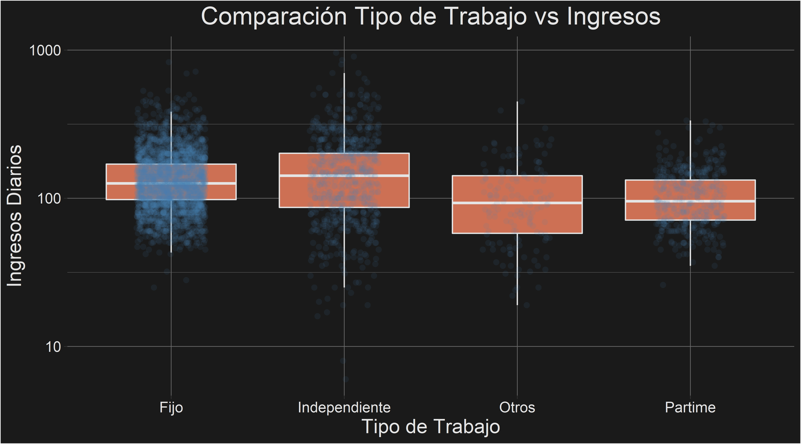

# Proyecto
## Diccionario de Datos
- `Status`: Evaluación Crediticia
- `Seniority`: Antiguedad en años en el trabajo
- `Home`: Es propietario, arrienda u otro 
- `Time`: El plazo del crédito solicitado
- `Age`: Edad del cliente
- `Marital`: Estado Civil
- `Records`: Existencia de historial crediticio
- `Job`: Tipo de trabajo
- `Expenses`: Cantidad de gastos
- `Income`: Ingresos
- `Assets`: Valorización de activos
- `Debt`: Deuda
- `Amount`: Monto del crédito 
- `Price`: Precio de los bienes

