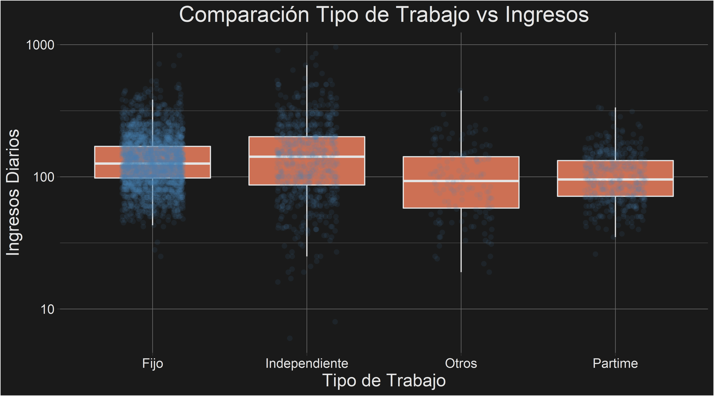

# Proyecto

El código de este proyecto se encuentra [aquí](Analysis.R).
## Diccionario de Datos
- `Status`: Evaluación Crediticia
- `Seniority`: Antiguedad en años en el trabajo
- `Home`: Es propietario, arrienda u otro 
- `Time`: El plazo del crédito solicitado
- `Age`: Edad del cliente
- `Marital`: Estado Civil
- `Records`: Existencia de historial crediticio
- `Job`: Tipo de trabajo
- `Expenses`: Cantidad de gastos
- `Income`: Ingresos
- `Assets`: Valorización de activos
- `Debt`: Deuda
- `Amount`: Monto del crédito 
- `Price`: Precio de los bienes

## Conclusiones
Del análisis de correlaciones se concluye que no hay multicolinearidad en los datos, por los tanto se procede a utilizar todas las variables en el proceso de machine learning.

Para comenzar el machine learning se comenzó con una separación de los datos, de 3/4 para el *conjunto de entrenamiento* y 1/4 para el *conjunto de prueba*.

El algoritmo ajustado fue regresión logística del paquete `glm`, en una primera instancia con clases desbalanceadas y una segunda instancia usando *upsampling*.

Los resultados indican que si se quiere minimizar el costo por error tipo-I, entonces no conviene usar upsampling, por el contrario para minimizar el costo del error tipo-II, es recomendable aplicar upsampling.

El máximo accuracy obtenido por la regresión logística es de 91,7% sin upsampling y 75,5% con upsampling; normalizar los predictores no mejoró el desempeño del modelo.

Para un futuro trabajo se propone usar técnicas de ingeniería de características y probar modelos mas complejos, por ejemplo: Random Forests, Support Vector Machine, Neural Networks y modelos de Boosting.